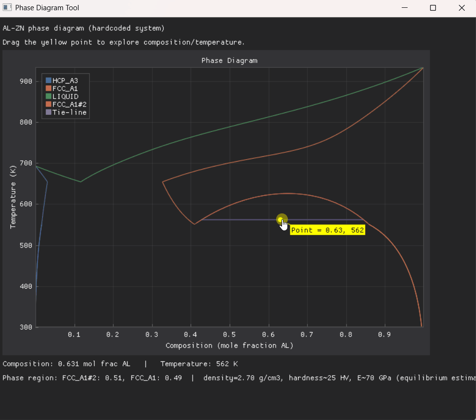

## Overview

A general-purpose materials science toolbox built around a shared architecture:
a common app shell that launches individual tools as standalone subprocesses,
rather than one monolithic application. This keeps each tool independently
launchable and lets different tools use different GUI frameworks if needed,
while a shared core Python library (separate from any tool's GUI) provides
the underlying materials science logic every tool draws from.

## First Tool: Binary Phase Diagram

The first tool in the toolbox is an interactive binary phase diagram plot.

## Architecture

- **Shell architecture** — a common launcher that starts each tool as its own
  subprocess, rather than routing everything through one internal application
- **Shared core library** — materials science logic (phase diagrams, crystal
  structures, mechanical property estimation) lives separately from any
  individual tool's GUI, so future tools can reuse it directly
- **Mechanical property estimation** — currently Level 1 (equilibrium-only,
  phase-fraction-weighted estimates), with Level 3 (real kinetics — TTT/CCT
  diagrams, heat treatment effects) planned as a future addition

## Planned Tools

- Diffusion
- Point defects (Schottky, etc.)
- Crystal structure visualization (FCC, BCC, etc.)
- An alloy builder tool combining phase diagrams, crystal structures, and
  mechanical properties into one workflow

[View on GitHub](https://github.com/ebrown91/MatSci-Toolbox)