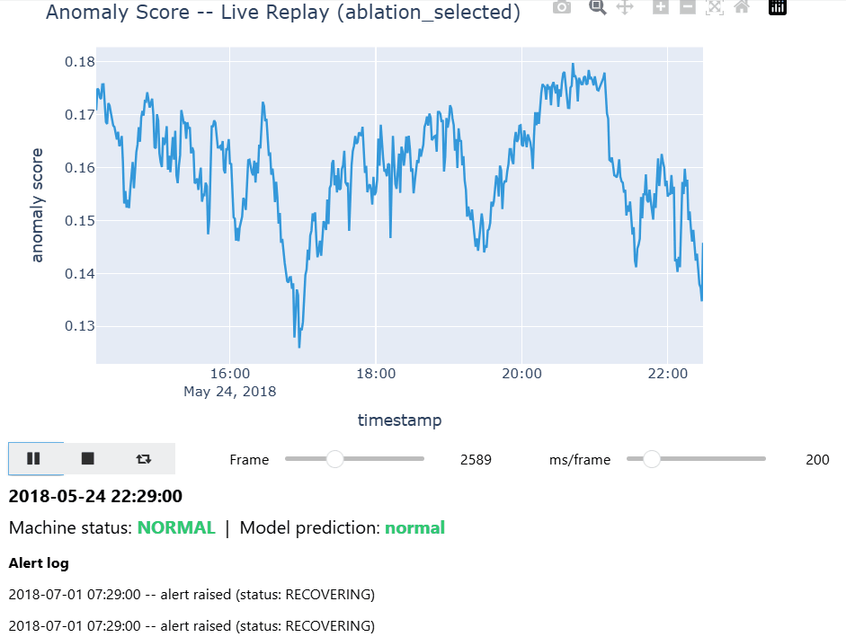

**UNDER CONSTRUCTION**

# Predictive Maintenance for Industrial Water Pump

Developed a machine-learning–based predictive maintenance pipeline using a publicly available industrial water pump dataset to identify abnormal operating behavior and detect conditions associated with impending equipment failure. The project focuses on building a realistic preventative maintenance workflow from raw time-series sensor data rather than relying solely on classification accuracy.

Key components include data quality analysis, sensor health assessment, temporal and mechanical feature engineering, failure-relevance ranking, and chronological walk-forward validation. An **Isolation Forest** anomaly-detection model is used to distinguish normal operation from recovering and failure-related behavior while avoiding random train/test splits that could introduce temporal leakage.

The project also investigates contamination-rate selection, false-alarm burden, pre-failure detection, feature redundancy, and model stability across different operating periods. Results are evaluated using precision, recall, F1 score, PR-AUC, and false alarms per day, with an emphasis on whether the model could provide useful early warning signals for maintenance decisions.

**Tools:** Python, Pandas, NumPy, Scikit-learn, Matplotlib, Jupyter/Kaggle
**Focus:** Predictive maintenance, anomaly detection, time-series analysis, feature engineering, machine learning, industrial IoT
